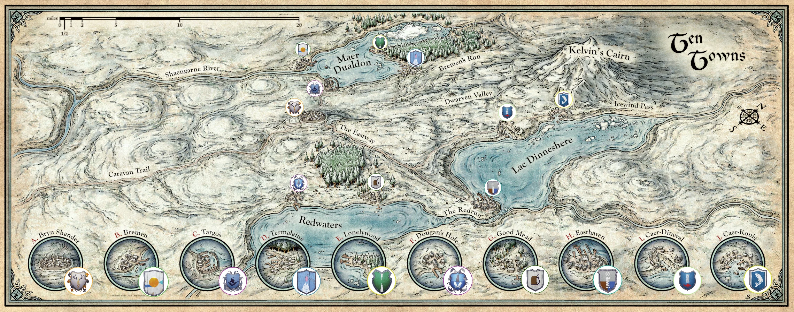

---
title: Max Mustermann
draft: false
tags:
  - mensch
  - Krieger
  - samplePlayer
---

Dies ist ein Beispiel für ein Spieler-Charakter. Die ```Personalquest und backstory``` wird nur dann hier veröffentlicht wenn, der Spieler dies möchte und die anderen Spieler davon wissen! 


## Appearence

<div style="display: flex; align-items: center;">
  
  <p style="margin-left: 20px;">Max Mustermann ist ein 40 Jahre alter Mensch.  Er ist 1,80 groß, trägt eine schwere eiserne Rüstung. Er ist nach Icedale gegangen um besondere Fische zu sammeln. </p>
</div>
<html>
<!-- Include Leaflet's CSS --> <link rel="stylesheet" href="https://unpkg.com/leaflet/dist/leaflet.css" /> <!-- Div container for your image --> <div id="map" style="width: 600px; height: 400px;"></div> <!-- Include Leaflet's JavaScript --> <script src="https://unpkg.com/leaflet/dist/leaflet.js"></script> <script>  Initialize Leaflet var map = L.map('map', { crs: L.CRS.Simple, minZoom: -5, });   var bounds = [[0,0], [1000, 1000]];  L.imageOverlay('../images/ysbfh96bj1s51.webp', bounds).addTo(map);   map.fitBounds(bounds); </script>
</html>


'../images/ysbfh96bj1s51.webp
## Rank
Level: 1 <br>
Ansehn TenTowns: 0
## Personalquest
Max Mustermann ist beauftragt worden um Fische für den König zu sammeln. 
Max ist ein Ritter des Lords Thomas. Er geht nach [[Bremen]].
## Backstory
Soldat <br>
Er gehörte zur Leibgarde des Grafen von Baldurs Gate. 
## noteworthy items

- Großschert mit Rubin 


<div class="zoomable-image">
  
</div>


