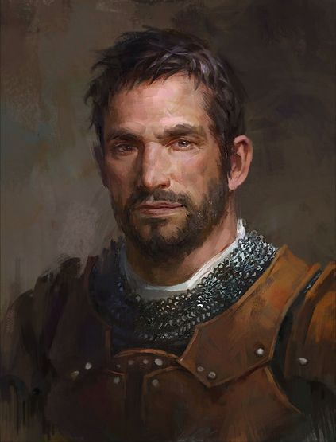

---
title: Max Mustermann
draft: false
tags:
  - mensch
  - Krieger
  - samplePlayer
---

Dies ist ein Beispiel für ein Spieler-Charakter. Die ```Personalquest und backstory``` wird nur dann hier veröffentlicht wenn, der Spieler dies möchte und die anderen Spieler davon wissen! 


## Appearence

<div style="display: flex; align-items: center;">
  
  <p style="margin-left: 20px;">Max Mustermann ist ein 40 Jahre alter Mensch.  Er ist 1,80 groß, trägt eine schwere eiserne Rüstung. Er ist nach Icedale gegangen um besondere Fische zu sammeln. </p>
</div>
## Description optional
trübselig
ruhig
mutig 

## Rank
Level: 1 <br>
Ansehn TenTowns: 0
## Personalquest
Max Mustermann ist beauftragt worden um Fische für den König zu sammeln. 
Max ist ein Ritter des Lords Thomas. Er geht nach [[Bremen]].
## Backstory
Soldat <br>
Max ist aufgewachsen in Baldurs Gate im mittelständischem Viertel. Er besucht Ten Towns, vor allem Bremen häufig mit seinem Vater im Winter. <br>
Er absolvierte die Ritterausbildung und gehörte seither zur Leibgarde des [[Koenig X]] von Baldurs Gate. <br>
Er verärgerte den König und wurde mit einer Fleißaufgabe beauftragt - Fische jagen und sammeln!

## noteworthy items

- Großschert mit Rubin 


