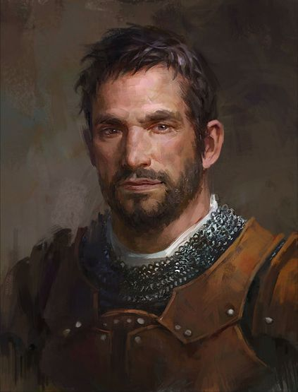

Dies ist ein Beispiel für ein Spieler-Charakter. Die ```Personalquest und backstory``` wird nur dann hier veröffentlicht wenn, der Spieler dies möchte und die anderen Spieler davon wissen! 

---
title: Max Mustermann
draft: false
tags:
  - mensch
  - Krieger
  - samplePlayer
---


## Description

<div style="display: flex; align-items: center;">
  
  <p style="margin-left: 20px;">Max Mustermann ist ein 40 Jahre alter Mensch. Er hat Frau und Kinder in Baldurs Gate. Er ist 1,80 groß, trägt eine schwere eiserne Rüstung. Max ist ein Ritter des Lords Thomas. Er ist nach Icedale gegangen um besondere Fische zu sammeln. </p>
</div>


## Rank
Level: 1 <br>
Ansehn TenTowns: 0
## Personalquest
Max Mustermann ist beauftragt worden um Fische für den König zu sammeln. 
## Backstory
Soldat <br>
Er gehörte zur Leibgarde des Grafen von Baldurs Gate. 
## noteworthy items

- Großschert mit Rubin 

